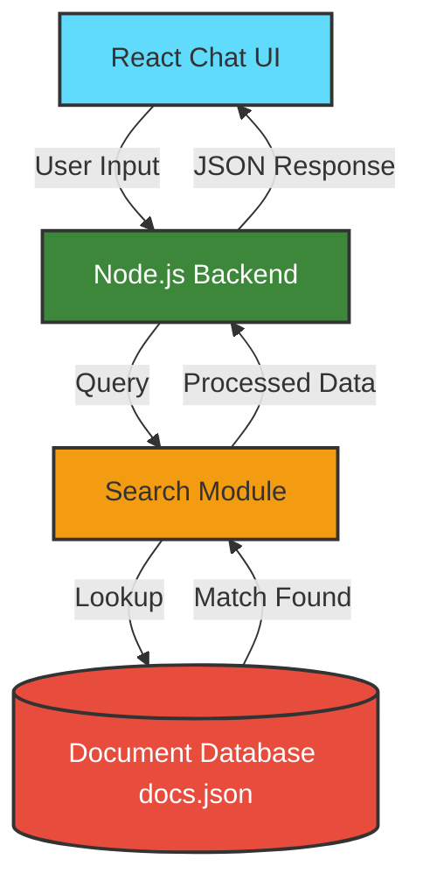

## System Architecture

## Architecture Components

| Component | Responsibility |
|----------|---------------|
| React Chat UI | Handles user interaction and chat message rendering |
| Node.js Backend | Receives queries and manages API requests |
| Search Module | Processes queries and performs similarity search |
| docs.json | Stores knowledge base documents used for retrieval |

## RAG Workflow

1. User sends a question through the chat interface.
2. The frontend sends the request to the Node.js backend.
3. The backend passes the query to the search module.
4. The search module finds relevant document chunks.
5. The most relevant information is returned to the frontend.
6. The chat interface displays the response.

## Note on LLM Integration

This project demonstrates the architecture of a Retrieval-Augmented Generation (RAG) system.

Due to API cost restrictions, OpenAI GPT models are not currently integrated.

The backend implements the retrieval layer and can easily be extended to connect with an LLM such as:

- OpenAI GPT
- Local LLMs
- HuggingFace models

The focus of this prototype is demonstrating the retrieval pipeline and system architecture.
## Screenshots

### Chat Interface

### Backend Response / Search Result

