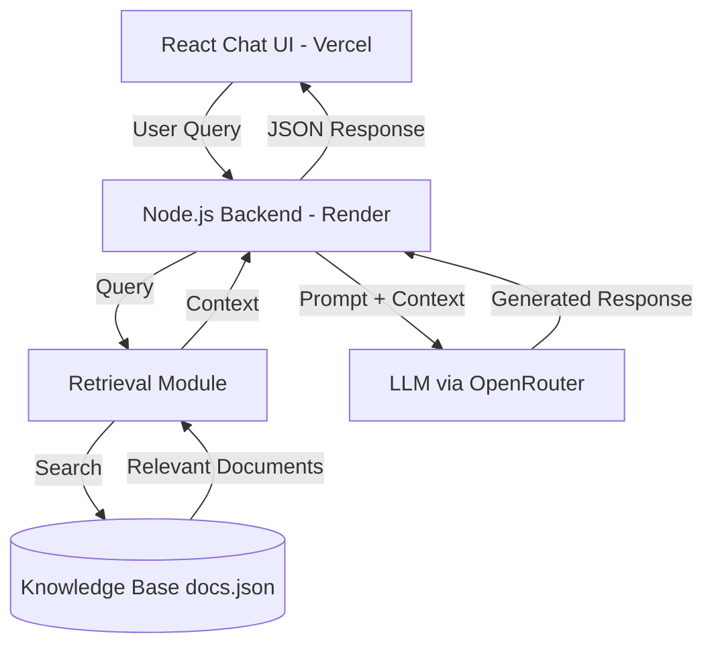
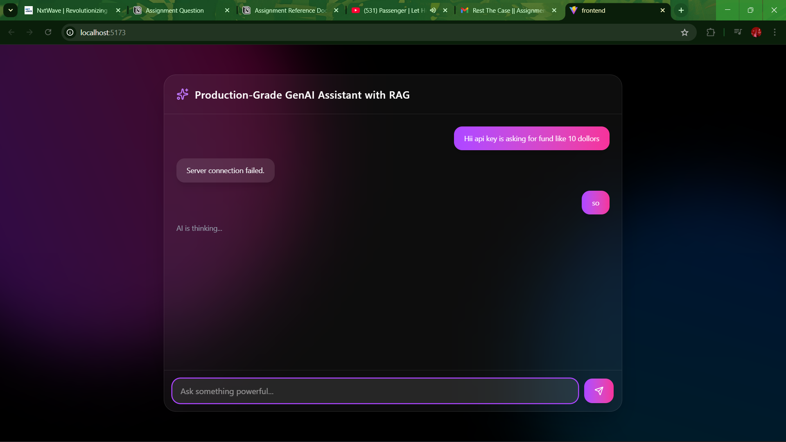
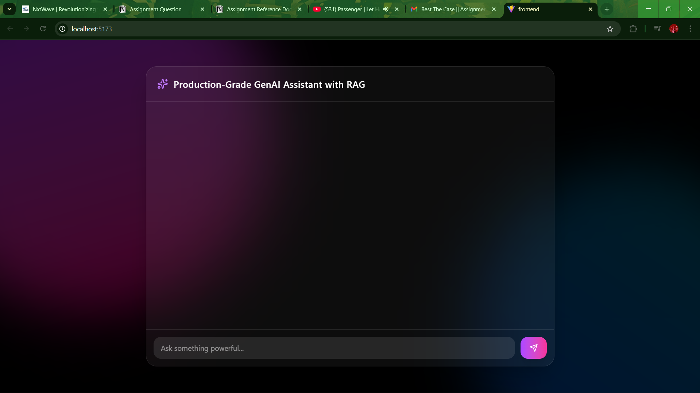

# Production-Grade GenAI Assistant with RAG

An AI-powered chat assistant built using **Retrieval-Augmented Generation (RAG)**.
The system retrieves relevant information from a custom knowledge base and combines it with a **Large Language Model (LLM)** to generate accurate, grounded responses.

This project demonstrates a **production-style full-stack AI architecture** with deployed frontend and backend services.

---

# Live Demo

Frontend
https://rag-assistant-beta.vercel.app

Backend API
https://rag-assistant-gm9x.onrender.com

---

# System Architecture



---

# Architecture Components

| Component        | Responsibility                                       |
| ---------------- | ---------------------------------------------------- |
| React Chat UI    | Handles user interaction and message rendering       |
| Node.js Backend  | Processes requests and orchestrates the RAG pipeline |
| Retrieval Module | Performs similarity search on document chunks        |
| docs.json        | Stores the knowledge base used for retrieval         |
| LLM (OpenRouter) | Generates responses using retrieved context          |

---

# RAG Workflow

1. User submits a question in the chat interface.
2. The React frontend sends the query to the Node.js backend.
3. The backend searches the knowledge base for relevant documents.
4. Retrieved context is injected into the LLM prompt.
5. The LLM generates a grounded response.
6. The backend returns the response and source documents.
7. The frontend displays the answer along with sources.

---

# Key Features

* Retrieval-Augmented Generation (RAG) architecture
* Context-grounded AI responses
* Custom document knowledge base
* Source citation for transparency
* Animated React chat interface
* Deployed full-stack architecture

---

# Tech Stack

### Frontend

React
Tailwind CSS
Framer Motion

### Backend

Node.js
Express.js

### AI / ML

Retrieval-Augmented Generation (RAG)
OpenRouter LLM API
Similarity-based document retrieval

### Deployment

Vercel (Frontend)
Render (Backend)

---

# Project Structure

```
rag-assistant
│
├── backend
│   ├── data
│   │   └── docs.json
│   ├── utils
│   │   └── search.js
│   └── server.js
│
├── frontend
│   ├── src
│   │   └── App.jsx
│
└── README.md
```

---

# Screenshots

### Chat Interface



### Backend Response with Sources



---

# Future Improvements

* Vector database integration (Pinecone / FAISS)
* Embedding-based semantic search
* Conversation memory
* Streaming responses
* Document upload support

---

# Author

Ruthwursun N
Electrical and Electronics Engineering
AI / ML Enthusiast

---

# Repository

https://github.com/Ruthwursun/rag-assistant
